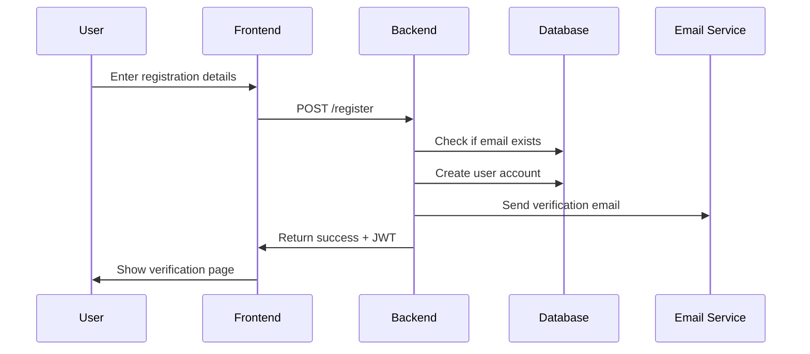
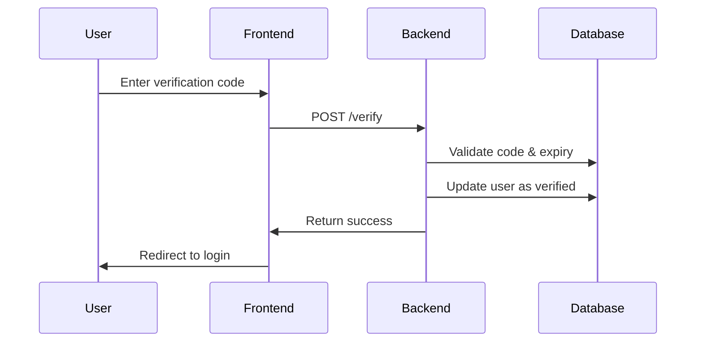
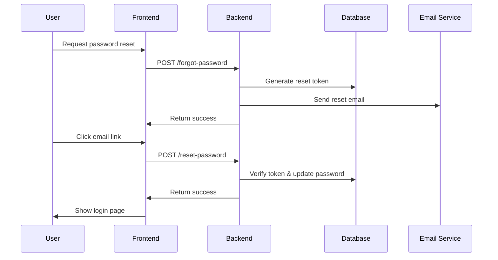
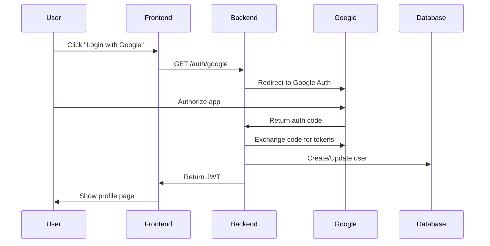
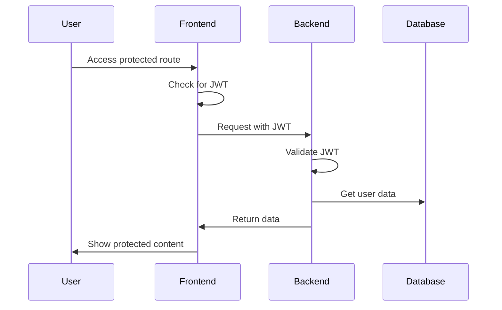
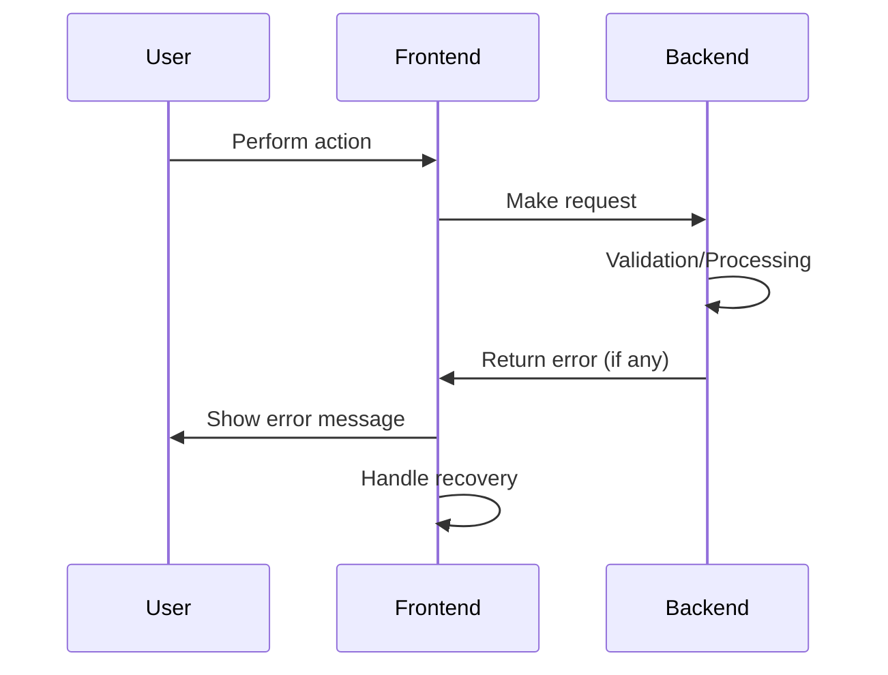

# Authentication Flows

## Registration Flow

```mermaid
sequenceDiagram
    participant U as User
    participant F as Frontend
    participant B as Backend
    participant DB as Database
    participant E as Email Service

    U->>F: Enter registration details
    F->>B: POST /register
    B->>DB: Check if email exists
    B->>DB: Create user account
    B->>E: Send verification email
    B->>F: Return success + JWT
    F->>U: Show verification page
```

## Email Verification Flow

```mermaid
sequenceDiagram
    participant U as User
    participant F as Frontend
    participant B as Backend
    participant DB as Database

    U->>F: Enter verification code
    F->>B: POST /verify
    B->>DB: Validate code & expiry
    B->>DB: Update user as verified
    B->>F: Return success
    F->>U: Redirect to login
```

## Password Reset Flow

```mermaid
sequenceDiagram
    participant U as User
    participant F as Frontend
    participant B as Backend
    participant DB as Database
    participant E as Email Service

    U->>F: Request password reset
    F->>B: POST /forgot-password
    B->>DB: Generate reset token
    B->>E: Send reset email
    B->>F: Return success
    U->>F: Click email link
    F->>B: POST /reset-password
    B->>DB: Verify token & update password
    B->>F: Return success
    F->>U: Show login page
```

## OAuth2.0 (Google) Flow

```mermaid
sequenceDiagram
    participant U as User
    participant F as Frontend
    participant B as Backend
    participant G as Google
    participant DB as Database

    U->>F: Click "Login with Google"
    F->>B: GET /auth/google
    B->>G: Redirect to Google Auth
    U->>G: Authorize app
    G->>B: Return auth code
    B->>G: Exchange code for tokens
    B->>DB: Create/Update user
    B->>F: Return JWT
    F->>U: Show profile page
```

## Protected Route Flow

```mermaid
sequenceDiagram
    participant U as User
    participant F as Frontend
    participant B as Backend
    participant DB as Database

    U->>F: Access protected route
    F->>F: Check for JWT
    F->>B: Request with JWT
    B->>B: Validate JWT
    B->>DB: Get user data
    B->>F: Return data
    F->>U: Show protected content
```

## Error Handling Flow

```mermaid
sequenceDiagram
    participant U as User
    participant F as Frontend
    participant B as Backend

    U->>F: Perform action
    F->>B: Make request
    B->>B: Validation/Processing
    B->>F: Return error (if any)
    F->>U: Show error message
    F->>F: Handle recovery
```
