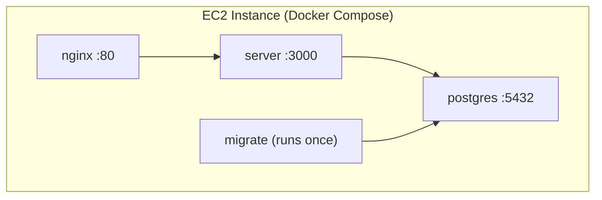

# Auth System — AWS CDK Deployment Summary

## What We Did

### 1. Reviewed the Infrastructure Code

The [`infra/`](file:///home/rishaw/myprojects/auth-system/infra) directory contains an AWS CDK stack that deploys the auth-system as a **single EC2 instance running Docker Compose**. The stack creates:

- **VPC** — 1 AZ, 1 public subnet, no NAT gateway (~$0)
- **Security Group** — ports 80 (nginx) and 3000 (API) open, no SSH
- **IAM Role** — SSM Session Manager access + ECR pull permissions
- **EC2 Instance** — t3.small, Amazon Linux 2023, 15GB GP3 disk
- **Docker Image Assets** — CDK builds & pushes the server and client Docker images to ECR automatically



### 2. Bootstrapped CDK

```bash
cd infra
npx cdk bootstrap
```

This is a **one-time setup** per AWS account/region. It creates an S3 bucket and ECR repo that CDK uses to stage assets during deployment.

### 3. Fixed Bugs & Deployed

We encountered and fixed **3 issues** in the CDK stack before a successful deployment:

#### Fix 1: Unicode in Security Group Descriptions

AWS rejects non-ASCII characters in security group rule descriptions.

```diff
# infra/lib/auth-system-stack.ts
- "HTTP → Nginx frontend"
+ "HTTP - Nginx frontend"
- "HTTP → Node API server"
+ "HTTP - Node API server"
```

#### Fix 2: Postgres Environment Variables Not Resolving

The docker-compose heredoc used a single-quoted delimiter (`'COMPEOF'`), which prevents shell expansion. The `${DB_USER}` references became literal strings, and Docker Compose couldn't resolve them from `env_file`.

```diff
# infra/lib/auth-system-stack.ts (docker-compose template)
  environment:
-   POSTGRES_USER: \${DB_USER}
-   POSTGRES_PASSWORD: \${DB_PASSWORD}
-   POSTGRES_DB: \${DB_NAME}
+   POSTGRES_USER: rishaw
+   POSTGRES_PASSWORD: demo_postgres_password_123
+   POSTGRES_DB: auth_system_db
  healthcheck:
-   test: ["CMD-SHELL", "pg_isready -U \${DB_USER} -d \${DB_NAME}"]
+   test: ["CMD-SHELL", "pg_isready -U rishaw -d auth_system_db"]
```

#### Fix 3: Missing Google OAuth Environment Variables

The server's Zod env validation requires `GOOGLE_CLIENT_ID`, `GOOGLE_CLIENT_SECRET`, and `GOOGLE_REDIRECT_URI`. Added placeholder values to the `.env.docker` heredoc.

```diff
# infra/lib/auth-system-stack.ts (.env.docker template)
  RESET_PASSWORD_EXPIRY=900
+ GOOGLE_CLIENT_ID=placeholder_google_client_id
+ GOOGLE_CLIENT_SECRET=placeholder_google_client_secret
+ GOOGLE_REDIRECT_URI=http://localhost/api/auth/google/callback
```

### 4. Fixed Client API URL (localhost → Reverse Proxy)

The Vite client had `VITE_API_BASE_URL=http://localhost:3000` baked in at build time, causing browser requests to fail when accessing the app from a public IP.

**Solution:** Added an nginx reverse proxy and changed the client to use relative URLs.

```diff
# client/.env
- VITE_API_BASE_URL=http://localhost:3000
+ VITE_API_BASE_URL=/api
```

```diff
# nginx/default.conf
  server {
      listen 80;
      root /usr/share/nginx/html;
      index index.html;

+     location /api/ {
+         proxy_pass http://server:3000/;
+         proxy_http_version 1.1;
+         proxy_set_header Host $host;
+         proxy_set_header X-Real-IP $remote_addr;
+         proxy_set_header X-Forwarded-For $proxy_add_x_forwarded_for;
+         proxy_set_header X-Forwarded-Proto $scheme;
+     }

      location / {
          try_files $uri $uri/ /index.html;
      }
  }
```

### 5. Deployed Successfully

```bash
npm run deploy   # npx cdk deploy --require-approval never
```

CDK output:

```
✅  AuthSystemStack
Outputs:
  AuthSystemStack.AppURL = http://<public-ip>
  AuthSystemStack.ServerApiURL = http://<public-ip>:3000
  AuthSystemStack.SSMConnectCommand = aws ssm start-session --target <instance-id>
```

### 6. Tore Down Everything

```bash
npm run destroy  # npx cdk destroy --force
```

All resources (EC2, VPC, security group, IAM role) deleted. No ongoing charges.

---

## Operational Reference

### SSM Shell Access (No SSH Needed)

```bash
# Connect to the instance
aws ssm start-session --target <instance-id> --region ap-south-1

# Switch to root (needed for Docker commands)
sudo su -
```

> [!NOTE]
> The SSM Session Manager plugin must be installed locally:
>
> ```bash
> curl -s "https://s3.amazonaws.com/session-manager-downloads/plugin/latest/ubuntu_64bit/session-manager-plugin.deb" -o /tmp/session-manager-plugin.deb
> sudo dpkg -i /tmp/session-manager-plugin.deb
> ```

### Viewing Docker Logs on the Server

```bash
# All containers (follow mode)
cd /opt/auth-system && docker compose logs -f

# Specific container
docker compose logs -f server    # Node API
docker compose logs -f nginx     # Frontend/proxy
docker compose logs -f db        # PostgreSQL

# Last N lines (no follow)
docker compose logs --tail=50 server
```

### Accessing the Database

```bash
cd /opt/auth-system
docker compose exec db psql -U rishaw -d auth_system_db
```

Useful psql commands:

```sql
\dt                  -- list all tables
\d users             -- describe a table
SELECT * FROM users; -- query data
\q                   -- quit
```

---

## Quick Reference Commands

| Action                            | Command                                                   |
| --------------------------------- | --------------------------------------------------------- |
| **Bootstrap** (once)              | `npx cdk bootstrap`                                       |
| **Deploy**                        | `npm run deploy`                                          |
| **Destroy**                       | `npm run destroy`                                         |
| **Synthesize** (preview template) | `npm run synth`                                           |
| **SSM connect**                   | `aws ssm start-session --target <id>`                     |
| **View logs**                     | `docker compose logs -f`                                  |
| **Access DB**                     | `docker compose exec db psql -U rishaw -d auth_system_db` |

---

Here are the only 2 resources that remain in your AWS account (ap-south-1 region):

### 1. S3 Bucket (CDK Staging Asset Bucket)

• Name: cdk-hnb659fds-assets-975049947863-ap-south-1
• Cost: Practically $0/month (only holds tiny metadata/templates).
• Purpose: Created automatically when bootstrapping CDK to stage deployment templates.

### 2. ECR Repository (CDK Container Asset Repository)

• Name: cdk-hnb659fds-container-assets-975049947863-ap-south-1
• Cost: <$0.10/month (just stores the pushed Docker image layers).
• Purpose: Stores the Docker images (server & client) that were built during cdk deploy.
──────

### What was deleted?

All active compute & network resources (EC2 instance, VPC, Subnets, Security Group, IAM
Roles) were completely deleted when we ran npm run destroy.

You will NOT be charged for EC2 compute, EBS disk, or networking.
──────

### (Optional) How to delete the remaining bootstrap resources:

If you want to clear your AWS account completely:

1. Delete the ECR Repository & Images:
   aws ecr delete-repository --repository-name cdk-hnb659fds-container-assets-
   975049947863-ap-south-1 --force --region ap-south-1

2. Delete the S3 Bucket:
   aws s3 rb s3://cdk-hnb659fds-assets-975049947863-ap-south-1 --force

3. Delete the CDK Bootstrap Stack:
   aws cloudformation delete-stack --stack-name CDKToolkit --region ap-south-1

The confirmation check finished, verifying that:

1. AuthSystemStack is 100% destroyed. All EC2 compute, VPC, subnets, and security groups
   are deleted (no ongoing server costs).
2. The only remaining stack is CDKToolkit, which contains the shared S3 bucket and ECR
   repository for CDK deployments.

You're all set!

Here are the only 2 resources that remain in your AWS account (ap-south-1 region):

### 1. S3 Bucket (CDK Staging Asset Bucket)

• Name: cdk-hnb659fds-assets-975049947863-ap-south-1
• Cost: Practically $0/month (only holds tiny metadata/templates).
• Purpose: Created automatically when bootstrapping CDK to stage deployment templates.

### 2. ECR Repository (CDK Container Asset Repository)

• Name: cdk-hnb659fds-container-assets-975049947863-ap-south-1
• Cost: <$0.10/month (just stores the pushed Docker image layers).
• Purpose: Stores the Docker images (server & client) that were built during cdk deploy.
──────

### What was deleted?

All active compute & network resources (EC2 instance, VPC, Subnets, Security Group, IAM
Roles) were completely deleted when we ran npm run destroy.

You will NOT be charged for EC2 compute, EBS disk, or networking.
──────

### (Optional) How to delete the remaining bootstrap resources:

If you want to clear your AWS account completely:

1. Delete the ECR Repository & Images:
   aws ecr delete-repository --repository-name cdk-hnb659fds-container-assets-
   975049947863-ap-south-1 --force --region ap-south-1

2. Delete the S3 Bucket:
   aws s3 rb s3://cdk-hnb659fds-assets-975049947863-ap-south-1 --force

3. Delete the CDK Bootstrap Stack:
   aws cloudformation delete-stack --stack-name CDKToolkit --region ap-south-1

The confirmation check finished, verifying that:

1. AuthSystemStack is 100% destroyed. All EC2 compute, VPC, subnets, and security groups
   are deleted (no ongoing server costs).
2. The only remaining stack is CDKToolkit, which contains the shared S3 bucket and ECR
   repository for CDK deployments.

You're all set!
